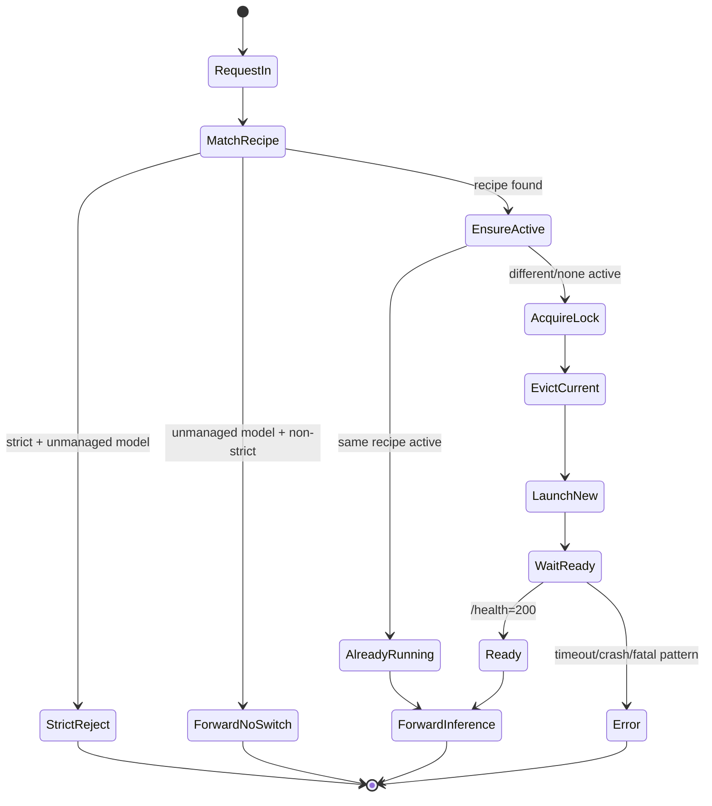
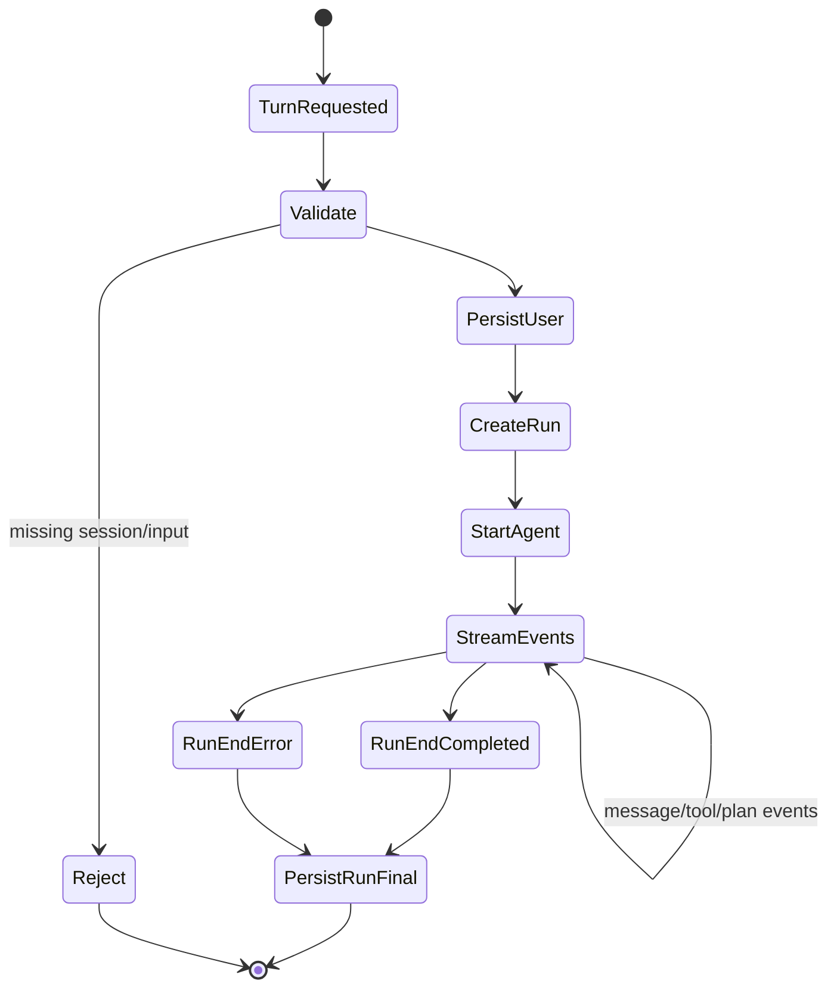
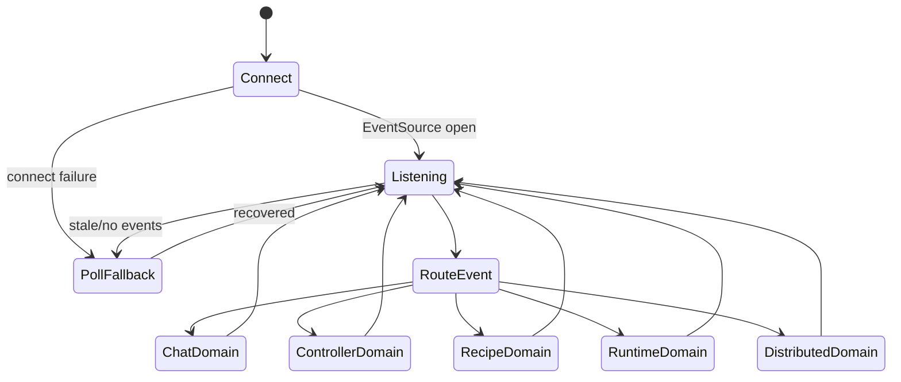

# Current Wiring and State Machines

## 1) Runtime wiring (what talks to what)

## Chat request path

```text
Chat UI (React/Zustand)
  -> frontend/src/lib/api.ts (client uses /api/proxy)
  -> frontend/src/app/api/proxy/[...path]/route.ts
  -> controller/src/modules/chat/chats-routes.ts (/chats/:sessionId/turn)
  -> controller/src/modules/chat/agent/run-manager.ts
  -> run-manager-sse.ts (SSE stream)
  -> frontend stream parser + run event handlers
  -> UI + store updates
```

## OpenAI-compatible path with lifecycle switch

```text
Client -> controller /v1/chat/completions
  -> openai-routes.ts
  -> find recipe by model
  -> lifecycleCoordinator.ensureActive(recipe)
  -> forward to inference / LiteLLM / provider routing
  -> return JSON or SSE
```

## Global event path

```text
Controller publishes EventManager events
  -> /events SSE (logs-routes.ts)
  -> frontend useControllerEvents()
  -> dispatch window custom events (vllm:chat-event, vllm:controller-event, ...)
  -> specialized hooks/stores consume and update UI
```

## Persistence path

- `controller.db` (shared): recipes, downloads, metrics, jobs, distributed nodes
- `chats.db` (chat-specific): sessions, messages, runs, run events, tool executions, agent file versions
- file persistence: `data/studio-settings.json`, log files, model directories
- LiteLLM analytics source: Postgres (`LiteLLM_SpendLogs`) with SQLite/chat fallbacks

## 2) State machine: model switching



## 3) State machine: chat turn stream



## 4) State machine: frontend controller event sync



## 5) Current drift and stress points

- Event contract drift risk:
  - frontend declares `mcp_*` controller event types but current frontend switch has no explicit handler path for them.
- Config source fragmentation:
  - backend URL/API key are persisted in multiple places (local storage/cookie/settings JSON/env) with precedence rules.
- Controller route layer is broad (many responsibilities in route files and managers), raising coupling and regression risk.
- Migration strategy is implicit runtime migration (`CREATE TABLE IF NOT EXISTS` + ad-hoc columns) rather than explicit versioned migrations.
